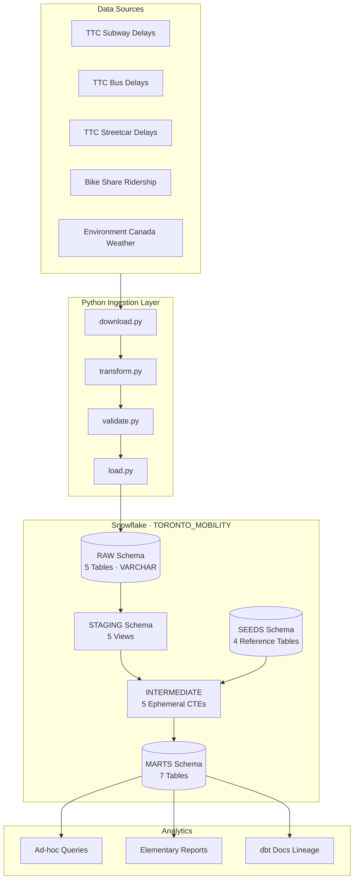
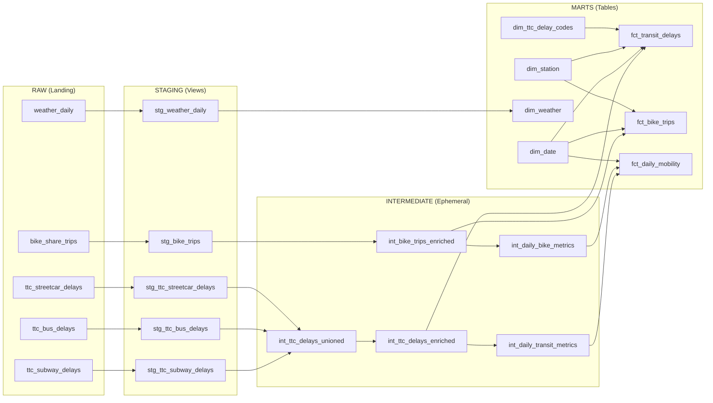
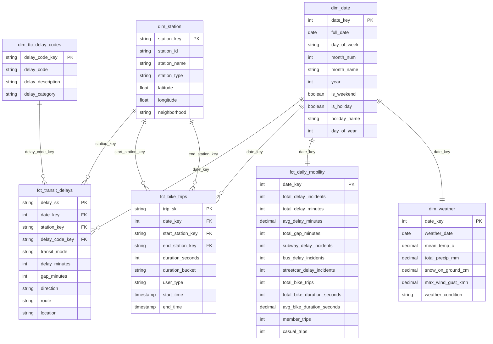

# Toronto Urban Mobility Analytics

[](https://github.com/dinesh-git17/toronto-mobility-analytics/actions/workflows/ci-dbt.yml)
[](https://github.com/dinesh-git17/toronto-mobility-analytics/actions/workflows/ci-python.yml)
[](https://github.com/dinesh-git17/toronto-mobility-analytics/actions/workflows/ci-lint.yml)
[](https://github.com/dinesh-git17/toronto-mobility-analytics/actions/workflows/governance.yml)

A production-grade data platform that integrates Toronto's transit delay records, bike share ridership, and daily weather observations into a unified analytical warehouse. The platform ingests data from five public sources, validates schemas at the boundary, and transforms raw records through a medallion architecture (staging, intermediate, marts) in Snowflake using dbt. The result is a star-schema warehouse powering cross-modal urban mobility analysis across six years of Toronto transit and cycling data.

---

> **22.25M+ validated rows** | **5 data sources** | **5 staging models** | **5 intermediate models** | **7 mart models** | **135 dbt tests** | **158 pytest tests** | **All queries < 1s on X-Small**

---

## Technology Stack

| Layer           | Technology             | Version     | Purpose                                               |
| --------------- | ---------------------- | ----------- | ----------------------------------------------------- |
| Warehouse       | Snowflake              | Enterprise  | Cloud data warehouse with RBAC and micro-partitioning |
| Transformation  | dbt Core               | 1.8+        | SQL-based medallion architecture transforms           |
| Ingestion       | Python                 | 3.12+       | Atomic download, validation, and loading pipeline     |
| Orchestration   | GitHub Actions         | --          | CI/CD with 5 workflow gates on every PR               |
| Testing         | dbt tests + pytest     | --          | 135 dbt schema/data tests, 158 Python unit tests      |
| Observability   | Elementary             | 0.16.1      | Volume anomalies, freshness monitoring, schema drift  |
| Data Quality    | dbt_expectations       | 0.10.4      | Value range validation and row count bounds           |
| Linting         | SQLFluff / Ruff / mypy | 3.3+ / 0.8+ | SQL dialect linting, Python linting, strict typing    |
| Package Manager | uv                     | --          | Deterministic Python dependency resolution            |

## Data Sources

| Source             | Dataset              | Format   | Rows   | Refresh | Coverage   |
| ------------------ | -------------------- | -------- | ------ | ------- | ---------- |
| Toronto Open Data  | TTC Subway Delays    | XLSX/CSV | ~237K  | Monthly | 2020--2025 |
| Toronto Open Data  | TTC Bus Delays       | XLSX/CSV | ~1.2M  | Monthly | 2020--2025 |
| Toronto Open Data  | TTC Streetcar Delays | XLSX/CSV | ~300K  | Monthly | 2020--2025 |
| Toronto Open Data  | Bike Share Ridership | CSV      | ~21.8M | Monthly | 2019--2025 |
| Environment Canada | Daily Weather        | CSV      | ~2.9K  | Daily   | 2019--2025 |

All data is publicly available. TTC delay data excludes 2019 due to incompatible column schemas. Bike share trips with duration < 60 seconds are filtered at the staging layer per industry standard for dock-based systems.

---

## Architecture

### System Overview



### Data Flow — Medallion Architecture



### Entity-Relationship Diagram



---

## Setup & Reproduction

### Prerequisites

| Tool              | Version    | Installation                                       |
| ----------------- | ---------- | -------------------------------------------------- |
| Python            | 3.12+      | [python.org](https://www.python.org/downloads/)    |
| Git               | 2.40+      | [git-scm.com](https://git-scm.com/)                |
| Snowflake Account | Enterprise | [signup](https://signup.snowflake.com/)            |
| uv (recommended)  | latest     | `curl -LsSf https://astral.sh/uv/install.sh \| sh` |

### 1. Clone and Install Dependencies

```bash
git clone https://github.com/dinesh-git17/toronto-mobility-analytics.git
cd toronto-mobility-analytics

# Create virtual environment and install dependencies
uv venv --python 3.12
source .venv/bin/activate
uv pip install -e ".[dev]"
```

### 2. Provision Snowflake

Execute the initialization scripts with a `SYSADMIN` role:

```bash
# Run in Snowflake worksheet or via snowsql
snowsql -f setup/snowflake_init.sql
snowsql -f setup/grants.sql
snowsql -f setup/create_ingestion_stage.sql
```

This creates:

- **Database:** `TORONTO_MOBILITY`
- **Schemas:** `RAW`, `STAGING`, `INTERMEDIATE`, `MARTS`, `SEEDS`
- **Warehouse:** `TRANSFORM_WH` (X-Small, auto-suspend 60s)
- **Roles:** `LOADER_ROLE` (ingestion), `TRANSFORMER_ROLE` (dbt)

### 3. Configure dbt Profile

```bash
# Copy the template
cp profiles.yml.example ~/.dbt/profiles.yml

# Set environment variables
export SNOWFLAKE_ACCOUNT="<your-account-identifier>"
export SNOWFLAKE_USER="<your-username>"
export SNOWFLAKE_PASSWORD="<your-password>"
export SNOWFLAKE_LOADER_PASSWORD="<loader-service-password>"

# Verify connection
dbt debug
```

The profile template defines three targets: `dev` (interactive development), `ci` (GitHub Actions), and `loader` (Python ingestion). See [`profiles.yml.example`](profiles.yml.example) for full configuration.

### 4. Run Ingestion Pipeline

```bash
# Download, transform, validate, and load all sources
python scripts/ingest.py
```

The pipeline executes atomically: download source files, convert XLSX to CSV, validate schemas against contracts, and MERGE into Snowflake RAW tables. On any schema mismatch, the entire run aborts with a non-zero exit code.

### 5. Build dbt Models

```bash
# Install dbt packages
dbt deps

# Load reference data (station mappings, delay codes, date spine, bike stations)
dbt seed

# Build all models and run tests
dbt build
```

---

## Mart Models

| Model                 | Type      | Grain                  | Rows       | Use Case                                         |
| --------------------- | --------- | ---------------------- | ---------- | ------------------------------------------------ |
| `fct_transit_delays`  | Fact      | One row per incident   | 237,446    | Delay root cause analysis by station, mode, code |
| `fct_bike_trips`      | Fact      | One row per trip       | 21,795,223 | Trip pattern analysis by station, duration, user |
| `fct_daily_mobility`  | Fact      | One row per date       | 1,827      | Cross-modal daily aggregation and correlation    |
| `dim_date`            | Dimension | One row per day        | 2,922      | Time intelligence with Ontario holidays          |
| `dim_station`         | Dimension | One row per station    | 1,085      | Unified TTC subway + Bike Share stations         |
| `dim_weather`         | Dimension | One row per day        | 2,922      | Daily weather with condition classification      |
| `dim_ttc_delay_codes` | Dimension | One row per delay code | 334        | Code-to-description-to-category mapping          |

---

## Sample Queries

Five analytical queries are provided in the [`analyses/`](analyses/) directory. Compile and execute via dbt or run directly in Snowflake after replacing `{{ ref() }}` with fully qualified table names.

```bash
# Compile all analyses to target/compiled/
dbt compile
```

| File                                                                    | Description                                             | Expected Rows |
| ----------------------------------------------------------------------- | ------------------------------------------------------- | ------------- |
| [`daily_mobility_summary.sql`](analyses/daily_mobility_summary.sql)     | Full cross-modal daily metrics with day-of-week context | ~1,827        |
| [`top_delay_stations.sql`](analyses/top_delay_stations.sql)             | Top 10 subway stations by cumulative delay minutes      | 10            |
| [`bike_weather_correlation.sql`](analyses/bike_weather_correlation.sql) | Bike ridership aggregated by temperature bucket         | 4             |
| [`cross_modal_analysis.sql`](analyses/cross_modal_analysis.sql)         | Bike trip volume on low/medium/high TTC delay days      | 3             |
| [`monthly_trends.sql`](analyses/monthly_trends.sql)                     | Month-over-month transit and cycling trend aggregation  | ~72           |

All five queries execute in under 1 second on an X-Small Snowflake warehouse (max observed: 0.954s). See [performance benchmark results](docs/PH-09/performance_results.md) for detailed timing.

---

## Testing

### Test Pyramid

```
    ┌─────────────────────────┐
    │  Performance Benchmarks │  5 queries, all < 1s
    ├─────────────────────────┤
    │   Data Quality Tests    │  dbt_expectations + Elementary
    ├─────────────────────────┤
    │   Integration Tests     │  Referential integrity (FK → PK)
    ├─────────────────────────┤
    │      Unit Tests         │  unique, not_null, accepted_values
    ├─────────────────────────┤
    │     Schema Tests        │  Source freshness, column existence
    └─────────────────────────┘
```

| Layer                  | Count | Tools                                  |
| ---------------------- | ----- | -------------------------------------- |
| dbt schema tests       | 135   | dbt core, dbt_expectations, Elementary |
| Singular SQL tests     | 5     | Custom assertions in `tests/`          |
| Python unit tests      | 158   | pytest, respx                          |
| Performance benchmarks | 5     | Snowflake X-Small warehouse            |

**Regression baseline:** 135 dbt tests | PASS=130 WARN=5 ERROR=0 | 66s on X-Small

```bash
# Run all dbt tests
dbt test

# Run Python tests with strict type checking
pytest
mypy --strict scripts/
ruff check .
```

Full test strategy and inventory: [`docs/TESTS.md`](docs/TESTS.md)

---

## CI/CD

Five GitHub Actions workflows gate every pull request to `main`:

| Workflow       | File             | Purpose                                        |
| -------------- | ---------------- | ---------------------------------------------- |
| **CI dbt**     | `ci-dbt.yml`     | dbt build, schema tests, Elementary validation |
| **CI Python**  | `ci-python.yml`  | pytest, mypy --strict, ruff check              |
| **CI Lint**    | `ci-lint.yml`    | SQLFluff (Snowflake dialect), ruff format      |
| **Governance** | `governance.yml` | Protocol Zero attribution scan                 |
| **Security**   | `security.yml`   | Dependency audit, secret scanning              |

All five checks must pass before merge. Squash-merge only; linear history enforced. Branch protection requires CODEOWNER approval with stale review dismissal.

---

## Observability

Elementary monitors all 7 mart models for volume anomalies, freshness anomalies, and schema changes. Reports are generated as self-contained HTML:

```bash
# Materialize Elementary artifact tables
dbt run --select elementary

# Generate observability report
edr report --output-dir target/elementary/
```

Operational procedures and incident response: [`docs/RUNBOOK.md`](docs/RUNBOOK.md)

Monitoring configuration and alert thresholds: [`docs/OBSERVABILITY.md`](docs/OBSERVABILITY.md)

---

## Project Structure

<!-- markdownlint-disable MD033 -->
<details>
<summary>Repository tree</summary>

```
toronto-mobility-analytics/
├── .github/
│   ├── ISSUE_TEMPLATE/
│   │   ├── bug_report.md
│   │   ├── feature_request.md
│   │   └── config.yml
│   ├── workflows/
│   │   ├── ci-dbt.yml
│   │   ├── ci-lint.yml
│   │   ├── ci-python.yml
│   │   ├── governance.yml
│   │   └── security.yml
│   ├── dependabot.yml
│   └── pull_request_template.md
├── analyses/
│   ├── bike_weather_correlation.sql
│   ├── cross_modal_analysis.sql
│   ├── daily_mobility_summary.sql
│   ├── monthly_trends.sql
│   └── top_delay_stations.sql
├── docs/
│   ├── PH-02/
│   ├── PH-03/
│   ├── PH-04/
│   ├── PH-05/
│   ├── PH-06/
│   ├── PH-07/
│   ├── PH-08/
│   ├── PH-09/
│   ├── PH-10/
│   ├── OBSERVABILITY.md
│   ├── RUNBOOK.md
│   ├── TESTS.md
│   └── PHASES.md
├── macros/
│   ├── generate_schema_name.sql
│   ├── get_date_spine.sql
│   └── _macros.yml
├── models/
│   ├── staging/
│   │   ├── ttc/
│   │   │   ├── _ttc__sources.yml
│   │   │   ├── _ttc__models.yml
│   │   │   ├── stg_ttc_subway_delays.sql
│   │   │   ├── stg_ttc_bus_delays.sql
│   │   │   └── stg_ttc_streetcar_delays.sql
│   │   ├── bike_share/
│   │   │   ├── _bike_share__sources.yml
│   │   │   ├── _bike_share__models.yml
│   │   │   └── stg_bike_trips.sql
│   │   └── weather/
│   │       ├── _weather__sources.yml
│   │       ├── _weather__models.yml
│   │       └── stg_weather_daily.sql
│   ├── intermediate/
│   │   ├── _int__models.yml
│   │   ├── int_ttc_delays_unioned.sql
│   │   ├── int_ttc_delays_enriched.sql
│   │   ├── int_bike_trips_enriched.sql
│   │   ├── int_daily_transit_metrics.sql
│   │   └── int_daily_bike_metrics.sql
│   └── marts/
│       ├── core/
│       │   ├── _core__models.yml
│       │   ├── dim_date.sql
│       │   ├── dim_station.sql
│       │   ├── dim_weather.sql
│       │   └── dim_ttc_delay_codes.sql
│       └── mobility/
│           ├── _mobility__models.yml
│           ├── fct_transit_delays.sql
│           ├── fct_bike_trips.sql
│           └── fct_daily_mobility.sql
├── scripts/
│   ├── config.py
│   ├── contracts.py
│   ├── download.py
│   ├── extract_station_names.py
│   ├── generate_bike_station_ref.py
│   ├── generate_date_spine.py
│   ├── generate_delay_codes.py
│   ├── generate_station_mapping.py
│   ├── ingest.py
│   ├── load.py
│   ├── transform.py
│   ├── validate.py
│   └── validate_load.py
├── seeds/
│   ├── _seeds.yml
│   ├── bike_station_ref.csv
│   ├── date_spine.csv
│   ├── ttc_delay_codes.csv
│   └── ttc_station_mapping.csv
├── setup/
│   ├── create_ingestion_stage.sql
│   ├── grants.sql
│   ├── snowflake_init.sql
│   └── validate_infrastructure.sql
├── tests/
│   ├── conftest.py
│   ├── test_download.py
│   ├── test_generate_bike_station_ref.py
│   ├── test_generate_date_spine.py
│   ├── test_ingest.py
│   ├── test_load.py
│   ├── test_seeds.py
│   ├── test_transform.py
│   ├── test_validate.py
│   ├── assert_bike_trips_reasonable_duration.sql
│   ├── assert_daily_row_count_stability.sql
│   ├── assert_no_future_dates.sql
│   ├── assert_no_negative_delays.sql
│   └── assert_station_mapping_coverage.sql
├── tools/
│   ├── install-hooks.sh
│   ├── protocol-zero.sh
│   └── run-checks.sh
├── .sqlfluff
├── .markdownlint.json
├── .pre-commit-config.yaml
├── CLAUDE.md
├── CODEOWNERS
├── DESIGN-DOC.md
├── dbt_project.yml
├── packages.yml
├── profiles.yml.example
└── pyproject.toml
```

</details>
<!-- markdownlint-enable MD033 -->

### Key Directories

| Directory   | Purpose                                                                  |
| ----------- | ------------------------------------------------------------------------ |
| `models/`   | dbt models organized by medallion layer (staging/intermediate/marts)     |
| `scripts/`  | Python ingestion pipeline (download, transform, validate, load)          |
| `seeds/`    | Reference data: station mappings, delay codes, date spine, bike stations |
| `tests/`    | Singular SQL tests and Python unit tests                                 |
| `analyses/` | Five analytical queries for benchmarking and exploration                 |
| `setup/`    | Snowflake DDL for database, schemas, warehouses, and roles               |
| `docs/`     | Epic specifications, test strategy, runbook, observability               |
| `macros/`   | Custom dbt macros (schema routing, date spine generation)                |
| `tools/`    | Local development scripts (pre-commit hooks, governance checks)          |

---

## Reference Data (Seeds)

| Seed                      | Rows  | Purpose                                                 |
| ------------------------- | ----- | ------------------------------------------------------- |
| `ttc_station_mapping.csv` | 1,101 | Maps raw station name variants to 75 canonical stations |
| `ttc_delay_codes.csv`     | 334   | Maps delay codes to descriptions and categories         |
| `bike_station_ref.csv`    | 1,009 | Bike Share Toronto station metadata with neighborhoods  |
| `date_spine.csv`          | 2,922 | Calendar dimension (2019--2026) with Ontario holidays   |

---

## dbt Packages

| Package                      | Version | Purpose                                    |
| ---------------------------- | ------- | ------------------------------------------ |
| `dbt-labs/dbt_utils`         | 1.3.0   | Surrogate keys, date spine, utility macros |
| `dbt-labs/codegen`           | 0.12.1  | Model and YAML scaffolding                 |
| `calogica/dbt_expectations`  | 0.10.4  | Value range and row count validation       |
| `elementary-data/elementary` | 0.16.1  | Volume anomalies, freshness, schema drift  |

All versions pinned for reproducible builds.

---

## Design Decisions

Key architectural decisions documented in [`DESIGN-DOC.md`](DESIGN-DOC.md):

| ID  | Decision                               | Rationale                                           |
| --- | -------------------------------------- | --------------------------------------------------- |
| D1  | Exclude TTC ridership data             | Aggregate-only; cannot join to individual delays    |
| D3  | Station matching via manual seed       | Higher accuracy than fuzzy matching                 |
| D6  | Fail-fast on schema changes            | Prevents silent data corruption in RAW              |
| D9  | Trip duration filter >= 60s            | Industry standard for dock-based bike share systems |
| D10 | Ephemeral intermediate materialization | Reduces Snowflake object count; no direct querying  |
| D12 | Elementary for observability           | Dynamic anomaly detection over static thresholds    |
| D13 | Pin all dbt package versions           | Reproducible CI builds and consistent test behavior |

---

## License

MIT

---

## References

- [DESIGN-DOC.md](DESIGN-DOC.md) -- Technical architecture and data model specification
- [docs/TESTS.md](docs/TESTS.md) -- Test strategy and full test inventory
- [docs/RUNBOOK.md](docs/RUNBOOK.md) -- Pipeline operations and incident response
- [docs/OBSERVABILITY.md](docs/OBSERVABILITY.md) -- Monitoring and anomaly detection procedures
- [docs/PHASES.md](docs/PHASES.md) -- Implementation phases and exit criteria
- [Toronto Open Data Portal](https://open.toronto.ca/)
- [Environment Canada Historical Climate Data](https://climate.weather.gc.ca/)
- [dbt Documentation](https://docs.getdbt.com/)
- [Elementary Data Observability](https://www.elementary-data.com/)
